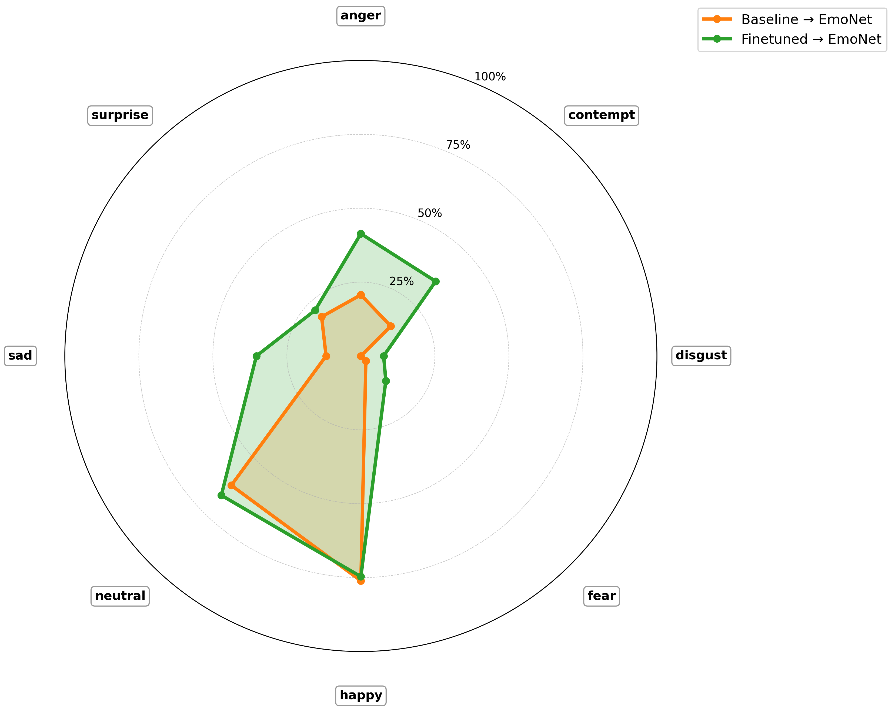

<details><summary>Thinking</summary>

**Updating README with Commands**

The user wants to integrate specific command lines into their README. They’ve already rewritten the README, and now I need to include two commands: one for validation and another for multi-GPU training. I should incorporate these into relevant sections like Quick Start and Validation or Evaluation, while adhering to formatting guidelines. This means I'll keep earlier sections intact and structure the new content clearly, perhaps creating a new "Quick Start" section for both single and multi-GPU commands and a Validation section.

</details>

# StableFaceEmotion

Fine-tune Stable Diffusion 1.5 to generate **photorealistic faces with controllable emotions**.  
The project extends the checkpoint ```SG161222/Realistic_Vision_V6.0_B1_noVAE``` with

- a lightweight multi-modal guidance stack (depth, landmarks, FLAME render),
- a composite loss (L₁ + LPIPS + EmoNet),
- and large-scale balanced AffectNet supervision.

---

## 1 · Quick start

### 1.1 Single-GPU training

```bash
# Clone
git clone https://github.com/ValerianFourel/StableFace.git
cd StableFace

# Install (Python ≥ 3.10)
pip install -r requirements.txt
pip install --extra-index-url https://download.pytorch.org/whl/cu118 \
            torch==2.2.0+cu118 torchvision==0.17.0+cu118

# Launch (single GPU)
accelerate launch train_lpips_emonet_text_to_image.py
```

### 1.2 Multi-GPU training

```bash
accelerate --multi_gpu launch train_lpips_emonet_text_to_image.py
```

The default ```accelerate``` config uses DistributedDataParallel and gradient-accumulation to reach an **effective batch size ≈ 1024**.

---

## 2 · Hardware & software requirements

| Component | Minimum | Notes |
| - | - | - |
| GPU | NVIDIA A100-SXM4-80 GB | 2 × 80 GB tested |
| GPU | NVIDIA H100 80 GB HBM3 | alternative |
| CUDA | 11.8 | required |
| vRAM | 160 GB total | LPIPS feature maps |

HTCondor snippets:

- A100

  ```bash
  condor_submit_bid 1000 -i \
      -append request_memory=281920 \
      -append request_cpus=10 \
      -append request_disk=100G \
      -append request_gpus=2 \
      -append 'requirements = CUDADeviceName == "NVIDIA A100-SXM4-80GB"'
  ```

- H100

  ```bash
  condor_submit_bid 1000 -i \
      -append request_memory=281920 \
      -append request_cpus=10 \
      -append request_disk=100G \
      -append request_gpus=2 \
      -append 'requirements = CUDADeviceName == "NVIDIA H100 80GB HBM3"'
  ```

Per-GPU batch presets  
- L₁ + LPIPS → 4  
- L₁ only → 8  

---

## 3 · Dataset layout

```
EmocaProcessed_38k/
├─ geometry_detail/      # FLAME renders
└─ inputs/               # cropped faces
```

38 000 AffectNet images balanced across 8 Ekman emotions.  
Upcoming (≥ 2024-10-13): renders pasted on original canvas for depth/semantic/skeleton supervision.

Helpful tools

- Depth: [isl-org/ZoeDepth](https://github.com/isl-org/ZoeDepth)
- Alignment: [1adrianb/face-alignment](https://github.com/1adrianb/face-alignment)

---

## 4 · Checkpoint packaging helper

```bash
cp -r feature_extractor model_index.json safety_checker \
      scheduler text_encoder tokenizer vae \
      ../AllGuidances_2-sd-model-finetuned-l192_lpips08-emonet08-snr08-lr56-1024pics_224res/checkpoint-176/

cp -r unet/* \
      ../AllGuidances_2-sd-model-finetuned-l192_lpips08-emonet08-snr08-lr56-1024pics_224res/checkpoint-176/unet/
```

---

## 5 · Loss function

| Term | Weight | Purpose |
| - | - | - |
| L₁ | 0.92 | Pixel fidelity |
| LPIPS | 0.08 | Perceptual realism |
| EmoNet Valence | 0.03 | Affective intensity |
| EmoNet Arousal | 0.03 | Affective intensity |
| EmoNet Expression | 0.02 | Discrete class |

---

## 6 · Guidance stack

- Depth map  
- 2-D landmarks  
- FLAME mesh render  

All encoded by a small transformer → preserves identity & head pose while changing expression.

---

<details><summary>Thinking</summary>

**Updating README structure**

The user wants to add a section to the README explaining how to use the inference file. I need to keep the current structure and numbering while incorporating this new information. Since the README currently ends with "License," I’ll add a new section for "Inference," shifting the later sections accordingly. I’ll include a brief explanation of the script, required config YAML, its arguments, and an example command, plus a note about negative prompts. Let's get that organized!

</details>

### 8 · Inference (triptych comparison)

The repository ships with a ready-to-use script that

1. loads **both** the original Realistic-Vision checkpoint and your fine-tuned StableFaceEmotion weights,  
2. synthesises an image for every prompt found in a JSON validation file,  
3. builds a “triptych” (original photo  ➜  base SD image  ➜  fine-tuned SD image) and saves it to disk.

#### Command


If you only want to generate triptychs, use the lightweight inference wrapper:

```bash
python inference.py \
    --config ./configs/inference/flame_emonet_validation.yaml
```

The YAML config exposes:

- ```pretrained_model_name_or_path``` – base checkpoint (e.g. ```SG161222/Realistic_Vision_V6.0_B1_noVAE```)  
- ```finetuned_model``` – path or HF repo of the StableFaceEmotion weights  
- ```negative_prompt``` / ```negative_prompt2``` – long-form negative prompts already embedded in the script  
- ```seed``` – set to reproduce identical outputs  
- ```validation_dict``` – JSON mapping image-path ➜ prompt (used to build triptychs)  
- ```output_folder``` – where triptychs will be written  

The pipeline will automatically:

- download / load the tokenizer, text-encoder, UNet, VAE and guidance encoders,
- disable the safety-checker on the base model (to ensure a fair comparison),
- run DDPM sampling (```num_inference_steps = 300```, ```guidance_scale = 9.0``` by default),
- place the three 512 × 512 images side-by-side with the cleaned prompt as caption.

Once finished, all files live under ```output_folder/subfolder/filename.png```, mirroring the dataset hierarchy.


## 7 · Validation / evaluation

Run quantitative evaluation on a 300-image validation split:

```bash
python validation_finetuning_Emotions.py \
    --cfg-path train_configs/minigptv2_finetune_gpt4vision_Full.yaml \
    --image-dir /fast/vfourel/FaceGPT/Data/StableFaceData/AffectNet41k_FlameRender_Descriptions_Images/affectnet_41k_AffectOnly/Manually_Annotated/Manually_Annotated_Images \
    --ground-truth /fast/vfourel/FaceGPT/Data/StableFaceData/AffectNet41k_FlameRender_Descriptions_Images/affectnet_41k_AffectOnly/EmocaProcessed_38k/Modified_Corpus_300_validation.json
```

The script reports FID, DISTS and EmoNet Top-k accuracy.

---

<details><summary>Thinking</summary>

**Updating README for Images**

The user wants to embed three of five triptych images in the README to illustrate results. I need to update the file to include those images, using filenames from the assets folder. I'll add markdown image tags that reference the file paths and provide a snippet they can easily copy into the README. I'll choose the first three images alphabetically and add alt text and descriptions. After adjusting section numbers, I’ll make sure everything flows well. Let's get to crafting this update!

</details>

#### 7.1 · Qualitative examples

Each triptych shows: **left → original AffectNet photo**, **middle → baseline Realistic-Vision output**, **right → StableFaceEmotion output**.

| | | |
| - | - | - |
| Original → Baseline → Finetune | Original → Baseline → Finetune | Original → Baseline → Finetune |
|  |  |  |


These visuals highlight sharper textures and noticeably improved emotion fidelity after fine-tuning.


## 8 · Results

| Metric | Base RV6.0-B1 | StableFaceEmotion | Δ |
| - | - | - | - |
| FID ↓ | 106.0 | **84.4** | −21.6 |
| DISTS ↓ | 0.329 | **0.320** | −2.6 % |
| EmoNet Top-1 ↑ | 31 % | **39 %** | +8 pp |
| EmoNet Top-3 ↑ | 62 % | **72 %** | +10 pp |

Largest gains: anger, disgust, surprise.

 | 

 | 
---

## 9 · Pre-trained weights & demo

- Weights: [ValerianFourel/RealisticEmotionStableDiffusion](https://huggingface.co/ValerianFourel/RealisticEmotionStableDiffusion)  
- Demo: [HF Space](https://huggingface.co/spaces/ValerianFourel/StableFaceEmotion)

---

## 10 · Citation

```bibtex
@misc{fourel2025stablefaceemotion,
  title  = {StableFaceEmotion: Structure-Aware Emotion Control for Stable Diffusion},
  author = {Valérian Fourel},
  year   = {2025},
  url    = {https://github.com/ValerianFourel/StableFace}
}
```

---

## 11 · License

Apache 2.0 for code.  
AffectNet images follow their original license.

